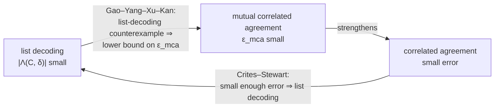
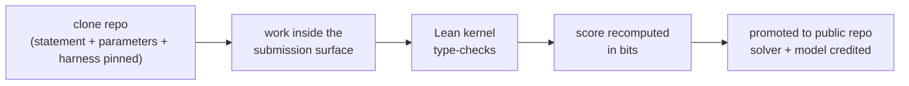

# From the Grand Challenge to better.codes: Scoring Reed-Solomon Soundness in Bits

> This is a follow-up to *Understanding the Grand List Decoding Challenge: From Polynomials to the Grand Challenge*. That document ended with the grand list decoding challenge in asymptotic form: find the largest $\delta_C^*$ such that the worst-case list stays small. This document covers what happens when the same question is asked at one fixed, finite parameter point, which is what the Ethereum Foundation's [better.codes](https://better.codes/) challenge does.

> Three things are new here. First, the *second* grand challenge, mutual correlated agreement (MCA), which is the property FRI and WHIR actually use; list decoding is its combinatorial shadow. Second, scoring in bits: at a fixed parameter point there are no asymptotics, so a result is a number, and the Lean kernel checks it. Third, the current state of the art, including the fact that the "up to capacity" conjectures from the intro document's §8 have been disproved.

---

## 0. Where the previous document stopped

The intro document ended at:

$$\text{find the largest } \delta_C^* \text{ such that } |\Lambda(C^{\equiv m},\delta_C^*)| \le \varepsilon^* \cdot |\mathbb{F}|,$$

with $\varepsilon^* = 2^{-128}$, over a smooth multiplicative domain, for constant $m$.

Two features make this a research problem rather than an engineering problem. It quantifies over "sufficiently large $|\mathbb{F}|$", so constants and lower-order terms disappear into $O(\cdot)$. And it asks for a single threshold $\delta_C^*$, not for what a verifier should do.

A deployed proof system has one field, one block length, one rate, one folding parameter, and a query budget that must be written down. So the question becomes:

```text
asymptotic question:  for large |F|, where is the threshold δ*_C ?
benchmark question:   at THIS (F, n, k, m), what error bound can you PROVE,
                      and how many bits is it worth ?
```

better.codes is the benchmark version of the question.

---

## 1. What better.codes is

better.codes is an "autoresearch" challenge launched in August 2026 by the Ethereum Foundation's formal verification team, together with Yukon and zkSecurity. It takes one self-contained problem from the Proximity Prize program, formalizes it in Lean 4 on top of ArkLib, pins it at a single parameter point, and puts the resulting soundness measurement on a public leaderboard.

| Piece | What it is |
|---|---|
| **Benchmark** | `koalaIRS12`: a fixed parameter profile for an interleaved Reed-Solomon reduction |
| **Statement** | A Lean 4 theorem statement, pinned in the challenge repository |
| **Harness** | Recomputes the score from the submitted proof |
| **Referee** | The Lean kernel; no human adjudication |
| **Output** | A score in bits, plus the diff and submission notes, upstreamed publicly |

Two design choices change what "progress" means.

**Machine-checked, not peer-reviewed.** A submission is accepted because the kernel type-checks it against a pinned environment. There is no lag between a claimed bound and a trusted one, and partial progress composes: lemmas, techniques, and impossibility results are upstreamed for the next solver to build on.

**Agentic by design.** Accepted results are credited to both the human solver and the AI model used. The challenge is an explicit experiment in machine-checked incremental research as a collaboration format.

> **@author**: clone the repository and read the pinned theorem statement. §3 below reconstructs the parameter point from secondary reporting and should be replaced with the repository's own definitions.

---

## 2. Scoring: two certificates and an open interval

The challenge does not ask for "the answer". It maintains a two-sided bracket around the answer, and both sides are competitive.

```text
        proved SAFE                                  proved UNSAFE
             │                                             │
   0 ────────┤═════════ open interval ════════════════════ ├──────── ∞
             │                                             │
      lower certificate                            upper certificate
       (soundness track)                             (attack track)
```

* The **soundness track** raises the lower certificate. You prove that the benchmark's reduction-error bound meets the target at some certified radius.
* The **attack track** lowers the upper certificate. You certify an *unsafe suffix*: a region where the benchmark's winning-set-density condition holds, so the property provably fails there.

The scoreboard number is the width of the remaining interval. As of 21 August 2026:

$$
\underbrace{63.99}_{\text{lower certificate}}
\quad\longleftrightarrow\quad
\underbrace{116.13}_{\text{upper certificate}}
\qquad\text{width } = 52.14 \text{ bits}.
$$

The direction of each bound matters:

```text
b ≤ 63.99            PROVED SECURE     machine-checked proof
63.99 < b < 116.13   UNKNOWN           not proved either way
b ≥ 116.13           PROVED INSECURE   machine-checked attack
```

The true security level of this parameter point is a number in $(63.99,\ 116.13)$, and nobody currently knows which.

**Why this framing works.** An open interval is falsifiable in both directions and cannot be gamed by optimism. "Roughly 100 bits" is not a submittable claim; you prove $\ge b$ or you exhibit a break at $\ge b$.

**The consequence for Ethereum's roadmap.** The M3 zkEVM milestone, now set for early December 2026, requires 128-bit provable security with a final proof of at most 300 KiB. The upper certificate sits at 116.13, below 128. At this parameter point, as currently certified, 128 bits is not merely unproved; it is on the wrong side of an attack certificate. That is why coverage frames the gap as a risk to the 128-bit goal.

**What the score is not.** The repository describes the score as a spot-check quantity for a fixed parameter point and "expressly excludes interpreting it as minus-log2 of whole-system soundness or as full-protocol security." Production security additionally depends on the model's completeness, the assumptions in its definitions, implementation fidelity, and the composition of separately analyzed components.

> **@author**: confirm the semantics of the upper certificate. Does the attack rule out $\ge 116.13$ bits *for this reduction as stated*, or *for the underlying code property*? A lossy reduction and a failing code property are different situations, and the reading of "128 is at risk" depends on which one it is.

> **@author**: the disclaimer above is quoted from press coverage of the repository. Replace it with a direct quote from the repository README.

---

## 3. koalaIRS12: reading the name

The benchmark name decomposes, probably, as:

```text
koala   IRS     12
  │      │       │
  │      │       └── parameter: interleaving width m?  log₂ n?
  │      └────────── Interleaved Reed-Solomon
  └───────────────── KoalaBear field
```

**KoalaBear.** The prime is

$$p = 2^{31} - 2^{24} + 1 = 2130706433.$$

It is a 31-bit field used in STARK stacks because it fits 32-bit arithmetic and because

$$p - 1 = 2^{24}\cdot 127,$$

so it has two-adicity 24: it contains a multiplicative subgroup $\mu_n$ for every $n = 2^s$ with $s \le 24$. These are the smooth multiplicative domains of the intro document's §6.

**IRS.** Interleaved Reed-Solomon: the $C^{\equiv m}$ construction of the intro document's §5, where $m$ codewords of the same $RS[\mathbb{F},L,k]$ are stacked and each coordinate is an element of $\mathbb{F}^m$.

**The 12.** Two plausible readings:

1. $m = 12$, an interleaving width of 12;
2. $\log_2 n = 12$, i.e. block length $n = 4096$, well inside KoalaBear's two-adicity of 24.

> **@author**: resolve this from the repository. Also record the rate $\rho$, the block length $n$, the degree bound $k$, and the field the verifier's randomness is drawn from. A 31-bit base field cannot support a $2^{-128}$ target on its own; these systems draw challenges from an extension $\mathbb{F}_{p^e}$. The $|\mathbb{F}|$ in $|\Lambda| \le \varepsilon^*|\mathbb{F}|$ is the *challenge* field, and $e$ does much of the work in the bit count.

> **@author**: check whether `koalaIRS12` is stated as a *reduction* problem (an error bound for one round of a FRI/WHIR-style reduction) or as a *pure list-size* problem. The phrase "reduction-error bound" suggests the former. If so, the list-size question of the intro document is an input to the benchmark, not the benchmark itself.

---

## 4. From list size to bits

The grand list decoding challenge asks for

$$|\Lambda(C^{\equiv m},\delta)| \le \varepsilon^*\cdot|\mathbb{F}|.$$

Define the **bit score at radius $\delta$**:

$$
b(\delta) \;=\; \log_2\!\left(\frac{|\mathbb{F}|}{|\Lambda(C^{\equiv m},\delta)|}\right)
\;=\; \log_2|\mathbb{F}| \;-\; \log_2|\Lambda(C^{\equiv m},\delta)|.
$$

The challenge is then: find the largest $\delta$ with $b(\delta) \ge 128$.

The ratio is taken against $|\mathbb{F}|$ rather than an absolute constant because that ratio is what the protocol pays. In a FRI/WHIR-style reduction the verifier draws a challenge from $\mathbb{F}$, and the failure mode is that the challenge lands in a bad set whose size is controlled by the list. The soundness error is (bad set size)$/|\mathbb{F}|$. A list of size $2^{100}$ in a field of size $2^{256}$ is a $2^{-156}$ event, not a large list.

```text
list size |Λ|     field size |F|     soundness error
2^30              2^256              2^-226    fine
2^100             2^256              2^-156    fine
2^140             2^256              2^-116    below target
2^30              2^64               2^-34     useless
```

The same arithmetic applies to any error of the form (count)$/q$. Worked example with the current asymptotic MCA bound (§9): Jo's result gives

$$\varepsilon_{\mathrm{mca}}(C,E) = O_{r,h}\!\left(\frac{K^6}{q}\right)$$

for $n = rK$ and error budget $E = \lfloor n - \sqrt{n(K-1)}\rfloor + h$, i.e. $h$ steps past the Johnson budget. In bits,

$$
b \;=\; \log_2 q \;-\; 6\log_2 K \;-\; c_{r,h},
$$

where $c_{r,h}$ is the hidden constant. For a length-64 code at rate $1/2$ ($K = 32$, $\log_2 K = 5$) over a field with $q < 2^{256}$:

$$
b \approx 256 - 30 - c_{r,h} \approx 226 - c_{r,h}.
$$

This clears 128 comfortably *if* $c_{r,h}$ is explicit and small. That is the reason the benchmark exists: the asymptotic statement does not give the constant, and at a finite parameter point the constant is the answer.

> **@author**: this is the highest-leverage item to chase. Find the explicit constant in the $O_{r,h}(\cdot)$ of eprint 2026/1432 and evaluate it at the koalaIRS12 point. $c_{r,h} = 8$ and $c_{r,h} = 100$ are the difference between clearing and missing the target.

---

## 5. Why more bits means smaller proofs

The intro document asserted that a larger provable decoding radius yields smaller proofs. Here is the calculation.

A FRI-style verifier makes $t$ independent spot-checks. If the prover's oracle is $\delta$-far from the code, each check catches it with probability at least $\delta$, so the prover survives all $t$ with probability at most $(1-\delta)^t$. To reach a $2^{-\lambda}$ query-soundness error you need

$$
t \;\ge\; \frac{\lambda}{\log_2\!\bigl(1/(1-\delta)\bigr)}.
$$

At the **Johnson radius** $\delta_J = 1 - \sqrt{\rho}$, $1-\delta_J = \sqrt{\rho}$, so

$$
\log_2\frac{1}{1-\delta_J} = \tfrac{1}{2}\log_2\frac{1}{\rho}.
$$

At **capacity** $\delta_{\mathrm{cap}} = 1 - \rho$, $1-\delta_{\mathrm{cap}} = \rho$, so

$$
\log_2\frac{1}{1-\delta_{\mathrm{cap}}} = \log_2\frac{1}{\rho}.
$$

The second is exactly twice the first at every rate:

> Moving the provable decoding radius from Johnson to capacity halves the query count, for any rate.

For $\lambda = 128$:

| Rate $\rho$ | $\delta_J = 1-\sqrt\rho$ | queries at Johnson | $\delta_{\mathrm{cap}} = 1-\rho$ | queries at capacity |
|---:|---:|---:|---:|---:|
| $1/2$ | $0.2929$ | $256$ | $0.5$ | $128$ |
| $1/4$ | $0.5$ | $128$ | $0.75$ | $64$ |
| $1/8$ | $0.6464$ | $86$ | $0.875$ | $43$ |
| $1/16$ | $0.75$ | $64$ | $0.9375$ | $32$ |

Each query costs a Merkle authentication path of about $\log_2 n$ hash digests. At $n = 2^{20}$ with 32-byte digests that is about 640 bytes per query before optimizations, so halving $t$ matters for a proof that has to fit in 300 KiB.

The same lever can be spent the other way: keep $t$ and raise $\rho$, which shrinks the prover's FFT and the committed oracle. Either way, the radius you can prove is the exchange rate between coding theory and proof size.

```text
larger provable δ
      ↓
fewer queries t  (or higher rate ρ)
      ↓
fewer Merkle paths
      ↓
smaller proof
```

> **@author**: this is the idealized per-query analysis. Real FRI/WHIR soundness has additional terms (round-by-round error, the proximity-gap/MCA term from §6, out-of-domain sampling). Use the query-complexity formula from the WHIR paper for anything load-bearing.

---

## 6. The second grand challenge: correlated agreement and MCA

The Proximity Prize has two grand challenges. The intro document covered list decoding. The other is **mutual correlated agreement**, and it is the one the protocols actually consume.

### Proximity gaps

Take a family of subsets of $\mathbb{F}^n$, say all affine lines. A code $C$ has a **proximity gap** for that family if every subset in the family behaves in one of two ways:

```text
either:  (almost) ALL points of the subset are δ-close to C
or:      (almost) NONE of them are
```

There is no middle ground where half the line is close. This dichotomy is what lets a verifier test a random linear combination of many oracles instead of testing each one.

### Correlated agreement

Proximity gaps say "many are close". Correlated agreement says they are close *in the same places*.

Take $u_0,\dots,u_{m-1} \in \mathbb{F}^L$ and form the line

$$u(z) = u_0 + z u_1 + \cdots + z^{m-1}u_{m-1}.$$

> **Correlated agreement.** If $\Pr_z[\Delta(u(z),C) \le \delta] > \varepsilon$, then there exist a single set $S \subseteq L$ with $|S| \ge (1-\delta)|L|$ and codewords $c_0,\dots,c_{m-1} \in C$ such that
> $$u_i|_S = c_i|_S \quad\text{for every } i.$$

The force is in the word *single*: one set $S$ shared by all $m$ inputs. In protocol terms, if the random combination looks close to the code, then every input individually agrees with a codeword on one common set of coordinates. That is what licenses batching.

### Mutual correlated agreement

MCA, introduced in WHIR, strengthens this one more step. Correlated agreement says a common agreement set *exists*. MCA says the common set is *the* explanation:

> **Mutual correlated agreement, informally.** For all but an $\varepsilon_{\mathrm{mca}}$ fraction of $z$, the agreement set of $u(z)$ with the code at radius $\delta$ is exactly the mutual agreement set $S$ on which all the $u_i$ simultaneously agree with codewords.

A $z$ where this fails is a **bad parameter**: $u(z)$ is $\delta$-close to $C$, but not because of the shared structure. Then

$$
\varepsilon_{\mathrm{mca}}(C,\delta) \;=\; \frac{\#\{\text{bad } z\}}{|\mathbb{F}|}.
$$

MCA is therefore a counting problem: how many bad parameters can an affine line have?

The grand MCA challenge mirrors the list-decoding one:

> **The grand MCA challenge.** For a Reed-Solomon code over a smooth multiplicative domain with $\rho(C) \in \{1/2, 1/4, 1/8, 1/16\}$ and $\varepsilon^* = 2^{-128}$, determine the largest $\delta_C^* \in [0,1]$ such that
> $$\varepsilon_{\mathrm{mca}}(C,\delta_C^*) \le \varepsilon^*,$$
> for $|\mathbb{F}|$ sufficiently large.

Why MCA rather than plain correlated agreement? In a recursive protocol like WHIR, each round's output is the next round's input. Plain correlated agreement loses structure each round; MCA composes across rounds without accumulating loss.

> **@author**: the informal MCA statement above is reconstructed. Take the exact definition from WHIR (eprint 2024/1586; the up-to-capacity version is its Conjecture 4.12) and from Arnon–Boneh–Fenzi (eprint 2026/680), including whether the quantification is over lines, affine subspaces, or arbitrary linear combinations, and whether "equals" or "contains" is the right relation.

---

## 7. How the two challenges are linked

Results push in both directions, which is why the pair is worth attacking together.



**Positive direction.** Crites and Stewart prove that correlated agreement with small enough error implies list decodability of Reed-Solomon codes. This was previously open, and it means a positive answer on the correlated-agreement side yields a list-decoding result.

**Negative direction.** Gao, Yang, Xu, and Kan show that list-decoding counterexamples yield lower bounds on MCA error. Given a linear code that is not $(p,L)$-list-decodable, they construct a related code $C'$ of the same length and dimension, differing in at most one coordinate index and with minimum distance smaller by at most one, such that

$$\mathrm{err}_{\mathrm{MCA}}(C',p) \;\ge\; \frac{1}{q}\left\lceil \frac{(L+1)q}{q+L} \right\rceil,$$

witnessed by an explicit pair of words. For structured families such as Reed-Solomon and AG codes the modification stays inside the family. This is the mechanism behind the attack track: you do not need to break a protocol, you need to exhibit a crowded Hamming ball.

```text
attack recipe (schematic):

  received word w with a large list at radius δ
            ↓
  affine line with many bad parameters
            ↓
  count bad parameters → lower bound on ε_mca
            ↓
  upper certificate on the achievable bits
```

Ben-Sasson, Carmon, Haböck, Kopparty, and Saraf also show, in the same setting, that improved proximity gaps go together with improved list-decodability bounds, and give lower bounds on the number of exceptional $z$ (of order $n^{1.99}$, or $n^\tau$, depending on parameters).

> **@author**: read arXiv 2607.10572 for the precise conversion, and note that it modifies one coordinate of the code. Check whether the benchmark's winning-set-density condition tolerates that or requires the counterexample on the code as pinned.

---

## 8. Why the ceiling is not capacity

The intro document (§4, §8) presented capacity $1-\rho$ as a ceiling below which a guarantee was at least conceivable. That needs updating, and it is the most important correction in this document.

**The up-to-capacity conjectures are false.** In November 2025, three independent papers within one week showed this: Crites–Stewart, Diamond–Gruen, and Ben-Sasson–Carmon–Haböck–Kopparty–Saraf. Crites and Stewart (eprint 2025/2046, CRYPTO 2026) disprove:

1. the correlated agreement up-to-capacity conjecture of Ben-Sasson–Carmon–Ishai–Kopparty–Saraf (J. ACM'23, Conjecture 8.4);
2. the mutual correlated agreement up-to-capacity conjecture of WHIR (Conjecture 4.12);
3. the list-decodability up-to-capacity conjecture of DEEP-FRI (Conjecture 2.3).

These are the conjectures underpinning the soundness and efficiency arguments of FRI, DEEP-FRI, STIR, and WHIR. As stated, for every $\delta \le 1-\rho-\eta$, they fail; they can hold at most up to the list-decoding capacity bound $H_q(\delta) < 1-\rho$, where $H_q$ is the $q$-ary entropy. The authors propose modified conjectures with the radius condition replaced by an entropy condition of that form.

```text
                Johnson                   somewhere here              capacity
     0 ────────── 1-√ρ ────────── ??? ────────────────────────────── 1-ρ ──── 1
                    │                                                  │
            provable, classically                          PROVED UNREACHABLE
                                                        (as naively conjectured)
```

**Where the counterexamples come from.** Two further papers (Krachun–Kazanin–Haböck, eprint 2026/782; Kambiré, arXiv 2604.09724, both April 2026) show failure close to capacity on exactly the domains this document is about: multiplicative subgroups of prime fields. The construction takes a prime $p \equiv 1 \pmod n$, an evaluation domain $H \le \mathbb{F}_p^\times$, and the affine line through the monomial evaluations $u_0 = x^{rm}$ and $u_1 = x^{(r-1)m}$. The analysis runs through the sumset $H^{(+r)}$ of sums of $r$ distinct elements of $H$, with a new additive-combinatorics lemma controlling its size. The result: at radii $O(1/\log n)$ below capacity, list sizes and MCA error reach $n^\tau$ for arbitrarily large $\tau$.

In other words, the algebraic structure the intro document flagged in §6 ("smooth domains are special") and §7 ("higher-order MDS does not transfer") is not a theoretical worry. It is the raw material of the counterexamples.

**What survives.**

| Region | Status |
|---|---|
| $\delta \le$ Johnson $= 1-\sqrt\rho$ | Provable. Exceptional $z$ at Johnson reduced from $O(n^2)$ to $O(n)$, i.e. error $O(n/q)$ (BCHKS). |
| Johnson $< \delta <$ capacity | The contest. Some post-Johnson budgets have explicit bounds (§9); some parameter regimes have $n^\tau$ lower bounds. |
| $\delta \to$ capacity $=1-\rho$, naive form | **Disproved.** |
| $\delta \to$ capacity, modified (entropy-bound) conjectures | Open. |

This reframes better.codes. The two-sided bracket is a direct response to the fact that a load-bearing conjecture was recently found to be false. Attack certificates are first-class because attacks are what happened.

> **@author**: the earlier draft attributed a characteristic-2 construction (an $\mathbb{F}_2$-subspace domain with monomials $X^u, X^v$) and a Mersenne-prime instance to "Ben-Sasson–Carmon". I could not confirm either. Check Diamond–Gruen (eprint 2025/2010) and BCHKS (ECCC TR25-169) for the characteristic-2 case, and Krachun–Kazanin–Haböck for the Mersenne instance. Also confirm the exact form of the three modified conjectures in Crites–Stewart.

---

## 9. The soundness track: what a winning proof looks like

Current state of the art on the positive side, for the smooth-domain, post-Johnson regime.

**Improved constants at Johnson.** Ben-Sasson, Carmon, Haböck, Kopparty, and Saraf (ECCC TR25-169) show that for Reed-Solomon codes of constant relative distance, the number of exceptional $z$ at the Johnson radius is $O(n)$, improving the previous $O(n^2)$; up to the unique decoding radius it is $O_\varepsilon(1)$. A factor of $n$ in the error is $\log_2 n$ bits on the scoreboard; at $n = 2^{12}$ that is 12 bits. Separately, Haböck (eprint 2025/2110) generalizes the BCIKS Guruswami–Sudan analysis to a "global" proximity gap, which is mutual correlated agreement.

**Deterministic bounds past Johnson.** Jo (eprint 2026/1432) shows, for $n = rK$ and budget

$$E = \lfloor n - \sqrt{n(K-1)}\rfloor + h,$$

that every affine line has at most $O_{r,h}(K^6)$ bad parameters, hence

$$\varepsilon_{\mathrm{mca}}(C,E) = O_{r,h}\!\left(\frac{K^6}{q}\right).$$

The shape matters: the budget is Johnson plus $h$, and the constant degrades in $h$. Each additional $h$ you can afford is more radius, hence fewer queries, hence a smaller proof.

The same paper gives exact $2^{-128}$ thresholds for four explicit smooth-domain codes of length 64: the largest safe integer budget, plus a proof that the next budget is unsafe. A threshold result is a matched pair of certificates. It also records that a single prime field $\mathbb{F}_Q$ with $Q < 2^{256}$ supports the required smooth domains at all four prize rates with $K = 2^{18}$ and MCA error below $2^{-128}$ at the stated post-Johnson budgets.

**Arbitrary evaluation sets over prime fields.** Jeronimo (arXiv 2609.05870, 5 September 2026) gives a "hidden-derivative" framework for list decoding and MCA of Reed-Solomon codes over prime fields on *arbitrary prescribed evaluation sets*. For fixed parameters it yields a deterministic polynomial-time list decoder with list size $n^{O_\gamma(1)}$ independent of $q$, and for lines an MCA error of $n^{O_\gamma(1)}/q$ with no proximity loss. If this holds up, it covers smooth multiplicative domains over prime fields directly, and the dependence of the exponent on the gap $\gamma$ to capacity is exactly what the counterexamples of §8 force.

**A structural observation.** A self-published technical report ([deltastar.computer](https://deltastar.computer/), June 2026, with a Lean development at `lalalune/ArkLib`) claims that the count governing the threshold at and below the boundary, an over-determined far-line incidence count, is "a union of isolated contributions and therefore does not depend on the field size at all in this regime". If correct, the hard part of the threshold stops being a character-sum estimate and becomes a counting problem, which is more amenable to explicit constants and Lean formalization. The same report gives a closed form $I_{\max}(n) = n^3/32 - n^2/8 + 1$, labeled computational and checked by enumeration for $n = 8, 12, \dots, 40$, and a windowed threshold $\delta^* = 1/2 + (2\rho^{-1}-1)/n$ validated at $\rho \in \{1/4, 1/8\}$.

> **@author**: the deltastar.computer material is unrefereed. The field-independence claim is labeled as kernel-certified there; the closed forms are labeled computational. Treat as leads until checked against the Lean development.

> **@author**: Jeronimo's paper is one week old and only the abstract has been read. Check the exact radius covered, what $\gamma$ denotes, and whether the bounds are explicit enough to evaluate at a finite point.

**What a submission has to do.** Raising the lower certificate means producing a Lean proof that the pinned reduction-error expression evaluates below the encoded target at a larger certified radius than the incumbent. Because the harness recomputes the score, there is no room for an asymptotic statement: every constant has to be a numeral.

---

## 10. The attack track: what a winning counterexample looks like

The attack track certifies an **unsafe suffix**: a region of the parameter range where the property provably fails, under the benchmark's *winning-set-density condition*.

Reading §7 backwards: find a received word whose list at radius $\delta$ is too large; convert the crowded ball into a line with many bad parameters; count. A large enough count is a machine-checked proof that the target cannot be met at that radius, which pulls the upper certificate down.

Two things make this tractable in the smooth-domain setting:

* the domain is $\mu_n$ or a coset $\alpha\mu_n$, so it satisfies rigid relations ($x^n = 1$ or $x^n = \alpha^n$; and $-x \in \mu_n$ for every $x$ when $n$ is even and the characteristic is odd), and those relations are constructive raw material;
* the near-capacity counterexamples of §8 already demonstrate that multiplicative-subgroup domains admit sumset-based constructions with the right cardinality behavior.

```text
generic random domain          →  algebraic coincidences are rare
smooth multiplicative domain   →  algebraic coincidences are the point
                                  (and an attacker gets to use them)
```

> **@author**: pin down "winning-set-density condition" from the repository. The phrase suggests the certificate is a density statement about a set of winning adversary strategies rather than a single explicit counterexample word, which changes what an attack submission has to construct. This is the largest gap in this document.

---

## 11. Machine-checked: why formalization changes the problem

Three reasons formalization is load-bearing here.

**Constants cannot hide.** A Lean statement at a fixed parameter point has no $O(\cdot)$. The difficulty of turning §9's asymptotic bounds into a score is the hidden $c_{r,h}$, and formalization forces it out.

**The literature had an error problem.** Three named conjectures in this area were disproved after being relied on in deployed-adjacent systems. Machine checking is a reasonable response to a field where the ratio of assumed to proved became uncomfortable.

**Incremental composability.** Because the environment is pinned and diffs are public, a lemma proved for one bound is immediately reusable. This is what makes a leaderboard work: a hundred small results that compose beat one large result that does not.



---

## 12. Where the next bits plausibly come from

| Direction | Track | Why it might pay |
|---|---|---|
| Explicit constants in $O_{r,h}(K^6/q)$ | soundness | Bookkeeping on an existing theorem. Highest ratio of bits to novelty. |
| Push $h$ further past Johnson | soundness | Directly buys radius, which directly buys queries. |
| Instantiate Jeronimo's framework | soundness | Covers arbitrary evaluation sets over prime fields; the question is whether the constants are explicit. |
| Field-independent combinatorial counting | soundness | If the threshold count is characteristic-free, the analysis simplifies and formalizes more easily. |
| Tighten the reduction itself | soundness | If the benchmark is a reduction-error bound (§3), some of the 52-bit gap may be reduction slack, not code-property slack. |
| Sumset constructions over $\mu_n$ | attack | Krachun–Kazanin–Haböck and Kambiré show the technique works over multiplicative subgroups. |
| Exploit $-x \in \mu_n$ pairings | attack | Free structure in odd characteristic at even $n$; the intro document's §6 relations are attacker-usable. |
| Higher-order MDS failure | attack | Smooth domains do not inherit it (intro §7); the failure is a place to look for crowded balls. |
| Modified (entropy-bound) capacity conjectures | either | The disproofs left proposed modifications open; settling one is prize-level. |

The framing to keep: 52 bits is not 52 bits of one thing. Some is slack in the reduction, some is slack in the list-size bound, some is slack in the constants, and some is mathematics nobody has done. Deciding which is which at the koalaIRS12 point is probably the most useful first piece of work.

---

## 13. Reading list

Primary, in rough order of usefulness for this document:

1. **Arnon, Boneh, Fenzi — *Open Problems in List Decoding and Correlated Agreement*.** [eprint 2026/680](https://eprint.iacr.org/2026/680). The survey the challenge is built on; defines the notation both grand challenges use. Read first.
2. **Crites, Stewart — *On Reed–Solomon Proximity Gaps Conjectures*.** [eprint 2025/2046](https://eprint.iacr.org/2025/2046), CRYPTO 2026. The disproofs of §8, the modified conjectures, and the correlated-agreement $\Rightarrow$ list-decoding reduction of §7.
3. **Ben-Sasson, Carmon, Haböck, Kopparty, Saraf — *On Proximity Gaps for Reed–Solomon Codes*.** [ECCC TR25-169](https://eccc.weizmann.ac.il/report/2025/169/). $O(n)$ exceptional $z$ at Johnson, $O(1)$ up to unique decoding, and lower bounds.
4. **Diamond, Gruen — *On the Distribution of the Distances of Random Words*.** [eprint 2025/2010](https://eprint.iacr.org/2025/2010). The third of the November 2025 disproofs.
5. **Krachun, Kazanin, Haböck — *Failure of proximity gaps close to capacity*.** [eprint 2026/782](https://eprint.iacr.org/2026/782). The multiplicative-subgroup, sumset-based counterexamples of §8.
6. **Kambiré — *Proximity Gaps Conjecture Fails Near Capacity over Prime Fields*.** [arXiv 2604.09724](https://arxiv.org/abs/2604.09724). Same phenomenon, prime-field multiplicative subgroups.
7. **Jo — *Reed–Solomon Mutual Correlated Agreement Beyond the Johnson Radius*.** [eprint 2026/1432](https://eprint.iacr.org/2026/1432). The $O_{r,h}(K^6/q)$ bound and the length-64 thresholds of §9.
8. **Arnon, Chiesa, Fenzi, Yogev — *WHIR: Reed–Solomon Proximity Testing with Super-Fast Verification*.** [eprint 2024/1586](https://eprint.iacr.org/2024/1586). Where mutual correlated agreement is introduced and where the query-complexity formulas live.
9. **Haböck — *A note on mutual correlated agreement for Reed-Solomon codes*.** [eprint 2025/2110](https://eprint.iacr.org/2025/2110). The Guruswami–Sudan generalization giving the "global" proximity gap.
10. **Gao, Yang, Xu, Kan — *List-Decoding Counterexamples Yield Lower Bounds on Mutual Correlated Agreement Error*.** [arXiv 2607.10572](https://arxiv.org/abs/2607.10572). The attack-track mechanism of §7.
11. **Jeronimo — *Algorithmic List Decoding at Capacity and Optimal Proximity Gaps for Reed–Solomon Codes*.** [arXiv 2609.05870](https://arxiv.org/abs/2609.05870). Prime fields, arbitrary evaluation sets; see §9.

Challenge infrastructure:

12. **[better.codes](https://better.codes/)**: the challenge, leaderboard, and repository.
13. **[The Proximity Prize](https://proximityprize.org/)**: the \$1M grand challenge statements.
14. **[EF announcement post](https://blog.ethereum.org/en/2026/08/20/better-codes-challenge)**: the framing and the submission model.
15. **[zkSecurity, *Proximity Gaps: What Happened and How Does It Affect our SNARKs*](https://blog.zksecurity.xyz/posts/proximity-conjecture/)**: practitioner summary of the November 2025 disproofs and their cost (about $2\times$ proof size and verifier time on proven parameters; 2–3% on the modified conjectures).

> **@author**: this document was assembled without direct access to better.codes (the site was not fetchable from this environment) and without the full text of eprint 2026/680. Every `@author` marker above flags something to replace with a primary-source reading. The numbers in §2 are a snapshot from 21 August 2026 and will move.

---

## Appendix: notation carried over and added

| Symbol | Meaning | Introduced |
|---|---|---|
| $C = RS[\mathbb{F},L,k]$ | Reed-Solomon code | intro §1 |
| $\rho = k/n$ | rate | intro §1 |
| $\Lambda(C,w,E)$ | list of codewords within $E$ of $w$ | intro §2 |
| $\Lambda(C^{\equiv m},\delta)$ | worst-case list at relative radius $\delta$ | intro §8 |
| $\delta_J = 1-\sqrt\rho$ | Johnson radius | intro §4 |
| $1-\rho$ | capacity | intro §4 |
| $C^{\equiv m}$ | bundled (interleaved) code | intro §5 |
| $\mu_n$, $\alpha\mu_n$ | smooth multiplicative domain / coset | intro §6 |
| $\varepsilon^* = 2^{-128}$ | prize error target | §2 |
| $b(\delta)$ | bit score at radius $\delta$ | §4 |
| $t$ | verifier query count | §5 |
| $\varepsilon_{\mathrm{mca}}(C,\delta)$ | mutual correlated agreement error | §6 |
| $E = \lfloor n-\sqrt{n(K-1)}\rfloor + h$ | post-Johnson error budget, $h$ steps past | §9 |
| $H_q(\delta)$ | $q$-ary entropy; the list-decoding capacity bound is $H_q(\delta) < 1-\rho$ | §8 |
| $H^{(+r)}$ | sumset of $r$ distinct elements of a subgroup $H$ | §8 |
| $p = 2^{31}-2^{24}+1$ | KoalaBear prime | §3 |
