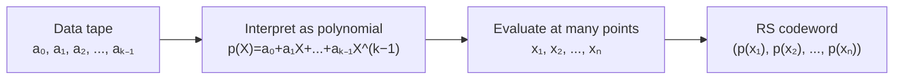
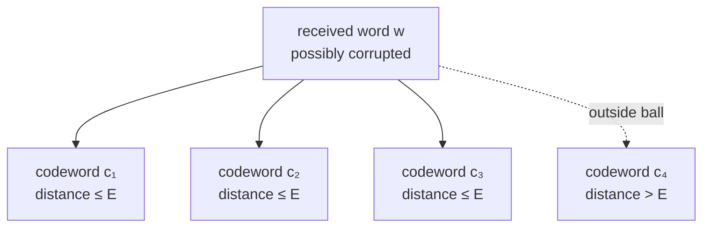
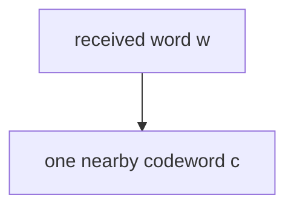
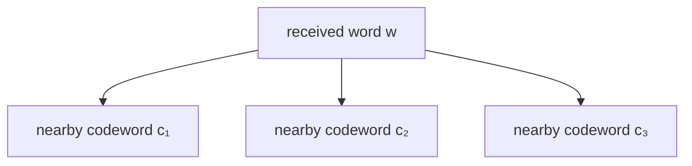
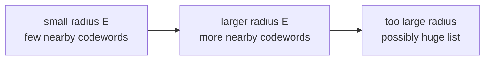

# Understanding the Grand List Decoding Challenge: From Polynomials to the Grand Challenge

> This document covers Reed-Solomon list decoding from basic principles and explains the concepts needed to understand the grand list decoding problem for interleaved and folded Reed-Solomon codes. We start from the basic picture, where data becomes a polynomial, and build up to the decoding question and the open challenge it leads to. No prior coding theory is assumed.

> Why does this matter? Solving the grand list decoding problem, as posed by the Ethereum Foundation's [Proximity Prize](https://proximityprize.org/), would lead to more efficient STARK-style proof systems. STARKs are transparent, hash-based, plausibly post-quantum proof systems, and modern constructions rely on Reed-Solomon proximity properties through protocols such as FRI and WHIR. Their security depends on how many codewords can crowd near a corrupted word: the list size. The smaller that list stays as more errors are allowed, the fewer checks a verifier needs and the smaller the proof can be. So pinning down the list size for these structured codes directly controls how compact these proof systems can be.

## 0. The High-Level Picture

A Reed-Solomon code turns data into evaluations of a low-degree polynomial.

```text
data  →  polynomial  →  evaluations  →  Reed-Solomon codeword
```

List decoding asks:

> Given a corrupted received word, how many valid Reed-Solomon codewords could be close to it?

The Grand List Decoding problem studies this question for an interleaved or folded Reed-Solomon code.

The central mathematical object is the list size:

$$|\Lambda(C,w,E)|$$

which means:

```text
the number of codewords in C within distance E of received word w
```

The worst-case version is:

$$B_C(E) = \max_w |\Lambda(C,w,E)|.$$

This quantity is the base Reed-Solomon list-size problem.

## 1. Reed-Solomon Codes: The Basic Idea

A Reed-Solomon code starts with data written on a "tape."

Think of the tape as holding field elements:

```text
tape:
+-------+-------+-------+-------+
|  a_0  |  a_1  |  a_2  |  a_3  |
+-------+-------+-------+-------+
```

Instead of treating these values as just a list, Reed-Solomon interprets them as the coefficients of a polynomial:

$$p(X) = a_0 + a_1X + a_2X^2 + a_3X^3.$$

So the tape

```text
[a_0, a_1, a_2, a_3]
```

becomes the polynomial

```text
a_0 + a_1 X + a_2 X^2 + a_3 X^3
```

If there are $k$ values on the tape, the polynomial has at most $k$ coefficients:

$$p(X) = a_0 + a_1X + a_2X^2 + \cdots + a_{k-1}X^{k-1}.$$

The largest exponent is $k-1$, so the polynomial has degree less than $k$:

$$\deg(p) < k.$$

That is what the parameter $k$ means:

> $k$ is the number of message coefficients, or equivalently the dimension of the Reed-Solomon code.

Reed-Solomon then evaluates this polynomial at many points:

$$x_1,x_2,\dots,x_n.$$

The output is:

$$\bigl(p(x_1),p(x_2),\dots,p(x_n)\bigr).$$

That output is the Reed-Solomon codeword.



The same idea as a table:

| Tape position | Tape value | Polynomial term |
|---:|---:|---:|
| $0$ | $a_0$ | $a_0$ |
| $1$ | $a_1$ | $a_1X$ |
| $2$ | $a_2$ | $a_2X^2$ |
| ⋮ | ⋮ | ⋮ |
| $k-1$ | $a_{k-1}$ | $a_{k-1}X^{k-1}$ |

So:

```text
k values on the tape
        ↓
polynomial with degree < k
        ↓
evaluate at n points
        ↓
codeword of length n
```

Usually $n$ is larger than $k$. That is the point: we start with $k$ pieces of data and expand them into $n$ evaluations.

The ratio

$$\rho = k/n$$

is called the rate.

* If $k$ is close to $n$, the code has little redundancy.
* If $k$ is much smaller than $n$, the code has more redundancy.
* More redundancy usually means better error tolerance.

A Reed-Solomon code is written as:

$$C = RS[\mathbb{F}, L, k]$$

where:

* $\mathbb{F}$ is the finite field.
* $L = \{x_1,\dots,x_n\}$ is the evaluation domain.
* $n = |L|$ is the block length.
* $k$ is the number of polynomial coefficients.
* $\rho = k/n$ is the rate.

The code consists of all vectors

$$\bigl(p(x)\bigr)_{x \in L}$$

where $p$ ranges over all polynomials with

$$\deg(p)<k.$$

### Code, codeword, and received word

Three objects are worth pinning down now, because they are easy to blur and the rest of these notes depends on the difference.

A **codeword** (singular) is one valid evaluated vector,

$$c = \bigl(p(x)\bigr)_{x \in L},$$

coming from a single message polynomial $p$. It has length $n$.

A **Reed-Solomon code** is the *set of all* such codewords, one for every message:

$$C = \{\, (p(x))_{x \in L} : \deg p < k \,\}.$$

So a codeword is a single element, and the code is the whole collection it lives in: $c \in C$. The "-word" ending is the tell: $[5, 9, 7, 8]$ is a *codeword*, while the *code* is the entire set of valid vectors it belongs to.

It also helps to keep the message separate from its codeword. The message has length $k$; the codeword has length $n$. The map from one to the other is the **encoder**, written $\mathrm{Enc}$. There is exactly one codeword per message, so the two sets have the same size, but they live in different spaces:

```text
message    msg ∈ F^k                     (k symbols)
            │ Enc
            ▼
codeword   c = Enc(msg) ∈ F^n            (n symbols: one valid vector)
code       C = { Enc(m) : all m } ⊆ F^n  (the set of ALL codewords)
```

Finally, a **received word** $w$ is what arrives after transmission. It has the same length $n$ as a codeword, so it sits in the same space $\mathbb{F}^n$. But the received word is not assumed to be a codeword:

$$\text{possibly } w \notin C.$$

If transmission was clean, then $w = c \in C$ and there is nothing to do. If symbols were corrupted, $w$ can be knocked off the code, to a point in $\mathbb{F}^n$ that is not a valid codeword at all. Recovering the original $c$ from such a $w$ is the job of decoding.

How far that recovery can be pushed is the subject of these notes. To make "how far" precise, we first need a way to measure distance.

## 2. Distance, Hamming Balls, and List Size

Decoding needs a way to say how far a received word is from a codeword. The tool is **Hamming distance**, which counts how many positions differ.

For example, a codeword next to a corrupted received word:

```text
received word: w = [5, 9, 2, 8]
codeword:      c = [5, 9, 7, 8]
```

These differ in one coordinate:

```text
w = [5, 9, 2, 8]
c = [5, 9, 7, 8]
          ^
       different
```

So their Hamming distance is 1.

If two words differ in at most $E$ positions, we say they are within distance $E$.

### Absolute distance vs relative distance

There are two common ways to measure closeness. Throughout, $c$ is a codeword (a valid element of $C$), $w$ is the received word, and both have length $n$.

The first is **absolute Hamming distance**:

$$
\Delta(c,w) = \text{number of coordinates where } c \text{ and } w \text{ differ}.
$$

This is the raw number of errors.

The second is **relative Hamming distance**, the same count divided by the length:

$$
\delta(c,w) = \frac{\Delta(c,w)}{n}.
$$

So when people say a received word $w$ is **$\delta$-close** to a codeword $c$, they mean

$$
\Delta(c,w) \le \delta n, \qquad\text{equivalently}\qquad \frac{\Delta(c,w)}{n} \le \delta.
$$

In words:

> $w$ is $\delta$-close to $c$ if the fraction of positions where they differ is at most $\delta$.

Example: if $n=100$ and $\delta=0.25$, then $w$ and $c$ may differ in at most $0.25 \cdot 100 = 25$ positions.

So:

```text
absolute radius: E errors
relative radius: δ = E / n
```

For an interleaved or folded Reed-Solomon code the same idea applies, but the length is the number of bundled coordinates. Each bundled coordinate may hold several field elements, yet Hamming distance still counts how many coordinate positions differ.

### How far does corruption push the received word?

We saw in §1 that a received word $w$ is not necessarily a codeword. With distance in hand we can be precise, but there are two separate questions here, and the key is keeping them apart:

1. Is $w$ itself a codeword?
2. How many codewords sit near $w$, and is the nearest one unique?

They have different answers, set by two different radii.

**How spread out the code is.** The governing quantity is the code's **minimum distance** $d$: the fewest positions in which two distinct codewords can differ. For a Reed-Solomon code,

$$d = n - k + 1.$$

This is the largest a minimum distance can possibly be (the Singleton bound). A code that reaches this maximum is called **MDS**, for *maximum distance separable*, and Reed-Solomon codes are the standard example. We unpack what MDS buys in §7; for now all we need is that codewords are at least $d$ positions from one another.

**A picture.** Imagine each codeword as a star in a large sky, with a bubble of radius

$$t = \left\lfloor \tfrac{d-1}{2} \right\rfloor$$

around it. Since any two codewords are at least $d$ apart, these bubbles never overlap. This $t$ is the **unique-decoding radius**. The received word $w$ is the sent codeword $c$ nudged by $e$ errors, so it sits $e$ steps away from $c$. Everything depends on the size of that nudge:

```text
errors e:   0            t                      d                    n
            |------------|----------------------|--------------------|
          w = c      bubble edge          a different
                  (unique-decode          codeword can
                     radius)              be reached

  e = 0         w is exactly c
  1 ≤ e ≤ t     w is off the code, and c is the ONLY codeword near it   → unique decoding
  t < e < d     w is off the code, but SEVERAL codewords may be near it → list decoding
  e ≥ d         w might itself BE another (wrong) codeword
```

Reading the bands:

* **$e = 0$:** nothing was corrupted, $w = c \in C$, done.
* **$1 \le e \le t$:** $w$ has left the code ($w \notin C$) but is still inside $c$'s bubble. No other codeword is that close, so $c$ is the unique nearest codeword. This is unique decoding.
* **$t < e < d$:** $w$ is still not a codeword, but it has drifted out of $c$'s bubble into the gaps between stars. Now *several* codewords can lie within a search radius, and from $w$ alone you cannot tell which was sent. This is where list decoding lives: the candidates are exactly the set $\Lambda(C,w,E)$.
* **$e \ge d$:** the nudge is large enough that $w$ can land on a *different* codeword. Then $w \in C$ again, but it is the wrong one, and nothing about $w$ reveals that.

Two takeaways. First, "$w$ is not a codeword" and "the nearest codeword is unique" are set by different thresholds: $w$ stays off the code for the whole range $0 < e < d$, but uniqueness is only guaranteed up to $t \approx d/2$. Second, the band past $t$ is the reason list decoding exists. Once corruption exceeds the unique-decoding radius, the correct answer to "which codeword was sent?" is a *list*, not a single word.

### Hamming balls

A **Hamming ball** is the set of all words within some radius of a center word.

Think of an ordinary ball:

```text
all points within radius E of a center point
```

A Hamming ball is the same idea, except distance means the number of coordinates where two words differ. Formally, the full Hamming ball of radius $E$ around a received word $w$ is

$$
B(w,E)=\{y \in \mathbb{F}^n : \Delta(y,w) \le E\}.
$$

That ball contains all ambient words near $w$, not just valid codewords. The list-decoding object we care about is the part of that ball that intersects the code:

$$
B(w,E) \cap C.
$$

So, informally, when we say "the codewords inside the Hamming ball," we mean

```text
all valid codewords that differ from w in at most E positions
```

Visually:



The full Hamming ball contains every nearby ambient word. In this picture, $c_1,c_2,c_3$ are the valid codewords inside that ball. The codeword $c_4$ is outside it.

### The list of nearby codewords

The list of nearby codewords is denoted

$$\Lambda(C,w,E) = \{c \in C : \Delta(c,w) \le E\}.$$

Equivalently,

$$
\Lambda(C,w,E)=B(w,E)\cap C.
$$

Read this as:

```text
Λ(C,w,E) = all codewords c in C that are within distance E of w
```

This is a *subset* of the code: $\Lambda(C,w,E) \subseteq C$. The code $C$ is the full catalog of codewords from §1; the list is the part of that catalog sitting near a given $w$.

The symbols:

| Symbol | Meaning |
|---|---|
| $C$ | the code |
| $w$ | the received word |
| $E$ | the error radius |
| $\Delta(c,w)$ | Hamming distance between $c$ and $w$ |
| $\Lambda(C,w,E)$ | the list of codewords near $w$ |

The number of nearby codewords,

$$|\Lambda(C,w,E)|,$$

is called the **list size**.

### Worst-case list size

For one received word $w$ the list might be small; for another it might be larger. So we care about the worst case over all possible received words:

$$B_C(E) = \max_w |\Lambda(C,w,E)|.$$

Read this as:

```text
B_C(E) = the biggest list size that can happen at radius E
```

In words:

> $B_C(E)$ is the largest number of Reed-Solomon codewords that can sit inside any Hamming ball of radius $E$.

### Why this quantity matters

The Grand List Decoding problem is not about one lucky received word. It is about the worst case.

The reason is that this list bound is used as a *security guarantee*. The setting behind the problem is proof systems and cryptographic commitments (such as FRI and STARKs), where the list size controls soundness: roughly, the chance that a cheating party can slip a bad proof past a verifier.

In that setting the received word is not produced by random noise. A party trying to cheat gets to hand over the most confusing word possible, chosen to make the list as large as it can be. So we picture an **adversary** choosing $w$, and we demand that the guarantee hold even against that worst-case choice. This is what the $\max_w$ in the definition is doing:

$$B_C(E) = \max_w |\Lambda(C,w,E)|.$$

So the important question is:

```text
What is the largest list size that can happen?
```

If $B_C(E)$ is small, every received word has only a small number of nearby codewords. If $B_C(E)$ is huge, some received word has many nearby codewords.

## 3. Unique Decoding vs List Decoding

When a message is encoded, there is one true Reed-Solomon codeword that was meant to be sent. But the decoder does not see that clean codeword. It sees a received word $w$, which may have been corrupted in some positions.

So the decoding question is:

> From the corrupted word $w$, what valid codeword or codewords could have produced it?

There are two possible situations.

In the best case, there is exactly one nearby codeword.

```text
received word w
      ↓
exactly one nearby codeword c
      ↓
return c
```

That is **unique decoding**.

In the more ambiguous case, there may be several nearby codewords.

```text
received word w
      ↓
several nearby codewords c₁, c₂, c₃
      ↓
return [c₁, c₂, c₃]
```

That is **list decoding**.

List decoding does not mean that the decoder guesses randomly until it finds the true message. It means the decoder returns the full set of valid codewords that are close enough to $w$:

$$\Lambda(C,w,E)=\{c\in C:\Delta(c,w)\le E\}.$$

The true transmitted codeword is somewhere in this list, assuming the corruption was within the chosen radius $E$. But the list decoder may not know which candidate is the true one. A later step may use extra information to choose among the candidates, such as a checksum, a hash, a commitment, a proof check, or some other protocol rule.

So the real issue is not whether we can find candidates. It is whether the candidate list stays small.

### Unique decoding

Unique decoding asks:

> Is there exactly one codeword close to the received word?

If yes, decoding is easy. You return that one codeword.



This is the cleanest situation. The received word points clearly to one valid codeword.

#### Example: unique decoding

Suppose the code contains the following valid codeword:

```text
c = [5, 9, 7, 8, 4, 2]
```

During transmission, one symbol gets corrupted:

```text
w = [5, 9, 0, 8, 4, 2]
```

Compare them:

```text
c = [5, 9, 7, 8, 4, 2]
w = [5, 9, 0, 8, 4, 2]
          ^
       one error
```

So:

$$
\Delta(c,w)=1.
$$

If the decoding radius is $E=1$, and no other codeword is within distance $1$ of $w$, then the list of nearby codewords is

$$
\Lambda(C,w,1)=\{c\},
$$

with list size $|\Lambda(C,w,1)|=1$. That is unique decoding.

In plain English:

> There is only one valid Reed-Solomon codeword close enough to the received word, so we treat it as the intended message.

### List decoding

List decoding asks a more general question:

> Which codewords are close to the received word?

Sometimes there may be several nearby codewords:



Then the decoder returns a list:

```text
[c₁, c₂, c₃]
```

This does **not** mean the decoder knows which one was originally sent. It means:

```text
these are the candidates that are consistent with the received word
```

That is useful if the list is small. It is not useful if the list is enormous.

#### Example: list decoding

Suppose the received word is:

```text
w = [5, 9, 0, 8, 4, 2]
```

Now suppose the code contains three valid codewords that are all within distance $2$ of $w$:

```text
c₁ = [5, 9, 7, 8, 4, 2]   distance 1 from w
c₂ = [5, 3, 0, 8, 4, 6]   distance 2 from w
c₃ = [1, 9, 0, 8, 4, 9]   distance 2 from w
```

> *(These vectors are illustrative. In a real Reed-Solomon code the minimum distance $n-k+1$ from §2 forces any two distinct codewords to differ in many positions, so real codewords cannot cluster this closely. The numbers are fine for seeing the shape of the list.)*

If the radius is $E=2$, then the list of nearby codewords is

$$
\Lambda(C,w,2)=\{c_1,c_2,c_3\},
$$

with list size $|\Lambda(C,w,2)|=3$. The decoder returns three candidates. It does not know which one was the original message.

The point is that the uncertainty has been reduced from:

```text
all possible codewords
```

to:

```text
these 3 nearby codewords
```

If some outside rule can identify the correct candidate, then list decoding is useful. For example, a larger protocol might say:

```text
only one candidate satisfies the next proof check
```

or:

```text
only one candidate has the expected hash / checksum / commitment
```

or:

```text
only one candidate is consistent with the rest of the transcript
```

So list decoding is often a first stage:

```text
received word
    ↓
small list of possible codewords
    ↓
use extra information to choose one, if needed
```

### From the list back to the message

A natural worry: if list decoding returns several codewords, how does anyone recover the *one* original message with no errors? The answer is that list decoding deliberately stops one step short, and two separate steps finish the job.

First, picking the true codeword out of the list is not done from $w$ alone. Past the unique-decoding radius, the received word by itself does not in general determine a single codeword, so a **selector** uses information from outside $w$: a hash or checksum sent separately, a commitment the sender published earlier, a proof check in the surrounding protocol (the FRI or STARK setting from §2), or plain side information such as "the real message is English text and the others are gibberish." That outside information collapses the list to one.

Second, once you hold a single codeword, recovering its message is exact and easy. A codeword is $n$ evaluations of a degree-$<k$ polynomial, and any $k$ of them interpolate that polynomial uniquely; its coefficients are the message. This is the only step where "zero errors" applies, and it is the trivial one.

```text
w ──list-decode──▶ {c₁, c₂, c₃} ──selector (outside info)──▶ c₁ ──interpolate──▶ msg
```

This document is about the first arrow only: how large that candidate list can be, and how far the radius can grow before it explodes. The selector and the interpolation are mentioned only so the full path from received word back to message is clear.

### Is list decoding probabilistic?

Not inherently. The mathematical definition is deterministic:

$$
\Lambda(C,w,E)=\{c\in C:\Delta(c,w)\le E\}.
$$

This set is the collection of all codewords inside a Hamming ball. There is no probability in that definition. Some decoding algorithms use randomness internally for efficiency, but that is separate from the concept of list decoding.

The core idea is combinatorial:

> How many valid codewords can fit inside a ball of radius $E$ around a received word $w$?

That question has a definite answer for each fixed code $C$, received word $w$, and radius $E$.

### Why list size matters

Suppose the list size is 3.

```text
received word w has 3 nearby codewords
```

That is manageable. But suppose the list size is huge.

```text
received word w has 1,000,000 nearby codewords
```

Then the received word is too ambiguous. So the central question is not:

```text
Can we decode?
```

The real question is:

```text
How many possible codewords could be close?
```

That is why we study $|\Lambda(C,w,E)|$ and $B_C(E)$.

### The decoding radius tradeoff

As the radius $E$ grows, the Hamming ball gets bigger, and a bigger ball can contain more codewords.



Unique decoding works only for a smaller radius. List decoding tries to go farther. The tradeoff is:

```text
larger decoding radius
        ↓
more errors tolerated
        ↓
possibly more candidate codewords
```

So list decoding is about how far the radius can be increased while keeping the list size controlled.

There is a classical threshold that makes this precise, called the **Johnson radius**. Below it, the list size is provably bounded. For a Reed-Solomon code of rate $\rho = k/n$, it sits at approximately

$$
\delta_J = 1-\sqrt{\rho}.
$$

For now, hold onto the picture: there is a "safe" radius up to which the number of nearby codewords cannot blow up. *We cover the Johnson radius in §4*, where it becomes the floor of the band that the Grand List Decoding challenge cares about.

### Summary of the objects

| Object | Meaning |
|---|---|
| $C$ | the Reed-Solomon code |
| $w$ | a received word |
| $E$ | the number of errors allowed |
| $\Lambda(C,w,E)$ | all codewords within distance $E$ of $w$ |
| $\lvert\Lambda(C,w,E)\rvert$ | list size around $w$ |
| $B_C(E)$ | worst-case list size over all received words |

In one sentence:

> List decoding studies how many valid codewords can be close to one corrupted word.

## 4. The Johnson Radius

The Johnson radius is the classical safe radius for Reed-Solomon list decoding.

It is usually written as a **relative radius**, a fraction of the block length $n$.

For a Reed-Solomon code of rate

$$
\rho = k/n,
$$

the Johnson radius is approximately

$$
\delta_J = 1-\sqrt{\rho}.
$$

Below this radius, the theory guarantees that a Hamming ball cannot contain too many Reed-Solomon codewords.

So if

$$
\delta < \delta_J,
$$

then every received word $w$ has only a controlled number of codewords $c$ satisfying

$$
\Delta(c,w) \le \delta n.
$$

**What "safe" means here.** "Safe" does not mean *likely to work*, and it does not mean *decoding succeeds*. It means **provably bounded**: there is a theorem guaranteeing the list stays small, bounded by a polynomial in $n$, and that guarantee holds for *every* received word, with no exceptions.

The list size is not a single fixed number. It depends on where the received word $w$ sits:

* many $w$ have an empty list, with no codeword within the radius;
* most $w$ have a small list, often $0$ or $1$;
* a few awkwardly placed $w$ can have a larger list, with several codewords crowding into one ball.

"Safe" is a statement about the *ceiling* across all of these. Below $\delta_J$, no received word anywhere, not even the adversary's worst choice, pushes the list above the guaranteed bound. Above $\delta_J$, that ceiling is no longer promised: some $w$ might have an exploding list, and ruling that out is the hard problem this document builds toward.

Two edge cases. A bounded list can still hold several candidates, so "safe" is not the same as unique decoding; and at very small radii, below the unique-decoding radius, every ball has at most one codeword.

Example:

If

$$
\rho = \frac14,
$$

then

$$
\delta_J = 1-\sqrt{\rho}=1-\frac12=\frac12.
$$

So the Johnson bound controls the list size up to about 50% errors. If $n=1000$, this means a radius of about $500$ coordinate errors.

Again, this does not mean there is a 50% probability of success. It means that, at this rate, every Hamming ball of radius about $500$ has a controlled number of Reed-Solomon codewords.

The hard region is beyond Johnson:

$$
\delta > 1-\sqrt{\rho}.
$$

The capacity-style ceiling is roughly

$$
1-\rho.
$$

So the important band is

$$
1-\sqrt{\rho}<\delta<1-\rho.
$$

This is the Johnson-to-capacity band. It is the zone the Grand List Decoding challenge (§8) cares about:

```text
Johnson radius       capacity-style ceiling
1 - sqrt(ρ)    < δ < 1 - ρ
```

The question is whether interleaved or folded Reed-Solomon codes (the bundled constructions introduced next, in §5) over structured domains can still have small list size in this beyond-Johnson region.

## 5. Interleaving and Folding

Up to here, every coordinate of a codeword has held a single field element (§1). The Grand List Decoding challenge is about *bundled* Reed-Solomon codes instead, where each coordinate holds a small tuple of field elements. There are two standard ways to build such a code, **interleaving** and **folding**. This section explains both, says why anyone bundles in the first place, and shows how the Hamming distance of §2 carries over to the bundled setting.

### Why bundle at all?

There are two reasons, one practical and one mathematical.

The practical reason is that the proof systems that motivate this problem (the FRI/STARK setting from the introduction) naturally produce bundled Reed-Solomon objects. The codes that actually need analyzing are bundled ones, not the plain code of §1.

The mathematical reason is the interesting one. Recall the two thresholds from §4: the Johnson radius $1-\sqrt{\rho}$, below which the list is provably small, and the capacity ceiling $1-\rho$, above which no guarantee is possible. For the *plain* code, the classical guarantee runs out at Johnson. Folding in particular is the classical lever for pushing the *achievable* decoding radius out of the Johnson region and toward capacity. So bundling is not idle repackaging; it is the construction that puts "can we decode all the way up to $1-\rho$?" on the table.

> The question this raises, and the one §8 finally pins down, is: **does grouping symbols move the list-decoding frontier, and how far?**

One reassurance before the mechanics. Bundling does **not** change the rate. Counting field elements, both constructions keep the ratio of message symbols to codeword symbols at $k/n$, so $\rho$ is what it was in §1. We are not buying error tolerance by adding redundancy; we are only *regrouping* the same symbols and asking whether the regrouping helps.

### Interleaving

Interleaving takes $m$ codewords **from the same Reed-Solomon code** $C = RS[\mathbb{F}, L, k]$, with the same evaluation domain $L$ and the same degree bound $k$ but $m$ different message polynomials $p_1, \dots, p_m$, and stacks them coordinate by coordinate.

Write the $m$ codewords as rows, one polynomial per row, evaluated across the shared domain:

```text
columns →        x₁        x₂        x₃        x₄
c₁  (from p₁):  p₁(x₁)    p₁(x₂)    p₁(x₃)    p₁(x₄)
c₂  (from p₂):  p₂(x₁)    p₂(x₂)    p₂(x₃)    p₂(x₄)
c₃  (from p₃):  p₃(x₁)    p₃(x₂)    p₃(x₃)    p₃(x₄)
```

Interleaving reads off the **columns**: each column becomes one bundled coordinate.

```text
bundle each column ↓

[ (p₁(x₁),p₂(x₁),p₃(x₁)), (p₁(x₂),p₂(x₂),p₃(x₂)), (p₁(x₃),p₂(x₃),p₃(x₃)), (p₁(x₄),p₂(x₄),p₃(x₄)) ]
```

Writing $a_i = p_1(x_i)$, $b_i = p_2(x_i)$, $d_i = p_3(x_i)$ for short, that is

```text
[ (a₁,b₁,d₁), (a₂,b₂,d₂), (a₃,b₃,d₃), (a₄,b₄,d₄) ]
```

So for an $m$-fold interleaving:

* the block length stays $n = |L|$; there are still $n$ coordinates;
* each coordinate is now an $m$-tuple, an element of $\mathbb{F}^m$ rather than of $\mathbb{F}$;
* coordinate $i$ bundles the $i$-th symbol of *every* layer, so the $m$ codewords share a single set of coordinate positions.

That last property is the point of interleaving. The layers are locked together at the same positions.

### Folding

Folding starts from a **single** Reed-Solomon codeword and bundles consecutive symbols of it. "Consecutive" only means something once we fix *how the evaluation domain is ordered*, and the standard ordering is the multiplicative one from §6.

Take the domain to be the $n$-th roots of unity,

$$L = \mu_n = \{1, \omega, \omega^2, \dots, \omega^{n-1}\}, \qquad \omega^n = 1,$$

listed in that order, so the codeword is

```text
c = [ p(1), p(ω), p(ω²), p(ω³), p(ω⁴), p(ω⁵) ]
```

Folding by $m$ (shown here with $m = 2$) groups the symbols into consecutive blocks:

```text
[ (p(1),p(ω)), (p(ω²),p(ω³)), (p(ω⁴),p(ω⁵)) ]
```

So for folding by $m$:

* the block length shrinks from $n$ to $n/m$; there are now $n/m$ bundled coordinates (we take $m$ to divide $n$, which it does in the FFT case);
* each coordinate is an $m$-tuple in $\mathbb{F}^m$, as in interleaving;
* the symbols inside a single fold sit at evaluation points related by $\omega$: a fold has the form $\bigl(p(y),\ p(\omega y),\ p(\omega^2 y),\ \dots,\ p(\omega^{m-1} y)\bigr)$, where $y$ is the first point of that fold. Stepping from one symbol of a fold to the next multiplies the evaluation point by $\omega$.

The third property is what makes folding more than relabeling. The bundled symbols are evaluations at a short geometric run of points $y, \omega y, \omega^2 y, \dots$ that steps through the domain by multiplying by the generator $\omega$. That rigid multiplicative relationship is the roots-of-unity structure of §6, and it is what a folded-RS decoder uses. So folding is built directly on top of the structured, FFT-friendly domains the challenge is concerned with.

A second convention, used in FRI-style folding, bundles the coset $y\cdot\mu_m = \{y, \zeta y, \dots, \zeta^{m-1}y\}$ instead, where $\zeta = \omega^{n/m}$ generates the subgroup of order $m$; for $m = 2$ this pairs $x$ with $-x$. Both conventions bundle points related by multiplication by a root of unity. Which one a given challenge uses is part of its definition.

### The two constructions side by side

```text
interleaving   m codewords, one shared RS code     →  bundle the columns
                length stays n                          each coordinate ∈ Fᵐ
                layers share coordinate positions

folding        1 codeword, root-of-unity domain    →  bundle consecutive symbols
                length shrinks to n/m                   each coordinate ∈ Fᵐ
                                                        symbols in a fold related by ω
```

Both end at the same *kind* of object: a code over the alphabet $\mathbb{F}^m$, whose coordinates are bundles of $m$ field elements. But they get there by different routes, interleaving stacking many codewords sideways and folding chopping one codeword into blocks, and they are different constructions, not two names for one thing.

### Distance on bundled coordinates

The Hamming distance of §2 carries over with one adjustment, already hinted at there: it counts **bundled** coordinates that differ, and a bundled coordinate counts as differing if *any one* of its $m$ entries is wrong.

```text
received:  w = [ (5,9), (2,1), (7,0), (8,4) ]
codeword:  c = [ (5,9), (2,3), (7,0), (8,4) ]
                          ^^^^^
                  one entry differs, so this whole
                  bundled coordinate counts as 1 error
```

Only a single field element is off here, but it spoils one bundled coordinate, so the bundled Hamming distance is $1$. The relative radius $\delta$ from §2 is then taken against the *bundled* length: $n$ for interleaving, $n/m$ for folding.

This metric is the reason the optimistic hope from "Why bundle at all?" is plausible. For a bundled codeword to land within radius $E$ of $w$, it has to agree with $w$ on at least (length $- E$) bundled coordinates, and agreeing on a bundled coordinate means agreeing on *all $m$ entries there at once*. A candidate must thread a narrower needle than in the unbundled code, so one expects fewer candidates to crowd into any single Hamming ball.

### What this section claims, and what it does not

Two cautions before moving on.

First, the "stricter agreement, so fewer candidates" argument is an intuition, not a theorem. Whether it survives in the beyond-Johnson band depends on the evaluation domain, and the structured domains of §6 may hand an adversary exactly the algebraic coincidences the intuition assumes away. Turning the hope into a guarantee is the open problem of §8.

Second, interleaving and folding are not interchangeable, even though they land on similar-looking objects. For the rest of the document, $C^{\equiv m}$ denotes the *specific* bundled code used in the Grand List Decoding challenge, with bundling parameter $m$. The interleaving and folding pictures above explain why bundled coordinates arise and why they might move the frontier, not that every bundling construction behaves identically.

## 6. Smooth Multiplicative Cosets and Generic RS

Many fast Reed-Solomon systems use roots of unity, or multiplicative cosets of roots of unity, as evaluation points.

Let

$$
\mu_n = \{1,\omega,\omega^2,\dots,\omega^{n-1}\},
$$

where

$$\omega^n = 1.$$

A common evaluation domain is either the subgroup itself,

$$
L = \mu_n,
$$

or a multiplicative coset of it,

$$
L = \alpha \cdot \mu_n = \{\alpha,\alpha\omega,\alpha\omega^2,\dots,\alpha\omega^{n-1}\}.
$$

For simplicity, keep $\alpha=1$ in mind. When $n=2^s$, this is an FFT-friendly domain. This is what people mean by a smooth multiplicative domain or smooth multiplicative coset.

Such a domain is highly structured rather than random. Its evaluation points are roots of unity, or a shifted copy of them, tied together by many algebraic relations. That structure is what makes the FFT fast, but it is also what sets these domains apart from the random-looking points the capacity theory was built on.

Generic or random Reed-Solomon codes use evaluation points that behave like random points, and random points usually avoid algebraic coincidences. Smooth Reed-Solomon codes do the opposite: they use structured roots of unity, which have many algebraic relations. For example, in the subgroup case,

$$x^n = 1$$

for all $x \in \mu_n$. In the coset case $x \in \alpha\mu_n$, the corresponding relation is

$$x^n = \alpha^n.$$

Also, whenever $n$ is even (which includes every FFT case $n = 2^s$), we have $-x \in \mu_n$ for *every* $x \in \mu_n$, since $(-x)^n = (-1)^n x^n = 1$. The same pairing holds inside a coset $\alpha\mu_n$. In characteristic 2 this says nothing, since there $-x = x$; the relation only bites in odd characteristic, where $-x \neq x$.

So smooth domains are special. This matters because modern random and generic Reed-Solomon capacity results rely on genericity assumptions.

## 7. Higher-Order MDS

Recall **MDS** from §2: a *maximum distance separable* code reaches the largest possible minimum distance, $d = n - k + 1$, and Reed-Solomon is the standard example. For higher-order MDS we need one more way to say the same thing. Since any $k$ evaluations of a degree-$<k$ polynomial determine it (§1), any $k$ coordinates already pin down the whole codeword; in generator-matrix terms, every set of $k$ columns is linearly independent. That phrasing is the one higher-order MDS generalizes.

Ordinary MDS says:

> Small sets of Reed-Solomon columns behave independently.

Higher-order MDS asks a stronger question:

> Do several groups of columns have intersections of the expected generic dimension?

An analogy:

- ordinary MDS asks whether one group of vectors behaves independently;
- higher-order MDS asks whether several spans overlap only as much as random spans would.

In plain terms: ordinary MDS is about one set of coordinates behaving independently. Higher-order MDS is about many coordinate subsets interacting as if they were random. This matters because recent capacity-style list-decoding results for generic or randomly punctured Reed-Solomon codes rely on this kind of generic intersection behavior. Smooth domains may violate those assumptions because roots of unity satisfy rigid algebraic identities.

Generic Reed-Solomon codes satisfy higher-order MDS. This property is used in modern generic and random Reed-Solomon capacity proofs.

Therefore, one possible strategy is:

> Prove smooth roots-of-unity domains also satisfy higher-order MDS, then import generic Reed-Solomon capacity results.

This strategy fails: smooth roots-of-unity domains do not inherit higher-order MDS in the form the generic proofs need, precisely because of the algebraic relations from §6. (The follow-up document, §8, describes explicit near-capacity counterexamples over multiplicative subgroups.) So the generic capacity results cannot simply be imported, and the beyond-Johnson behavior of these structured codes stays open.

That tension, where the generic theory promises capacity but the structured FFT domains of §6 may not inherit it, is what makes the following challenge worth stating precisely.

## 8. The Grand List Decoding Challenge

We now have every piece we need:

- the **list** $\Lambda(C,w,E)$ of codewords near a received word, and its **worst-case** size over all received words, $B_C(E)$ (§2);
- the **relative radius** $\delta = E/n$ (§2);
- the **bundled code** $C^{\equiv m}$ from interleaving or folding (§5);
- the **Johnson floor** $1-\sqrt{\rho}$ and the **capacity ceiling** $1-\rho$, with the interesting band in between (§4);
- the fact that fast systems use **structured, non-generic** evaluation domains (§6), so the generic **higher-order MDS** machinery does not transfer for free (§7).

A note on notation before the statement. We write $\Lambda(C^{\equiv m},\delta)$ with **two** arguments, not three: the received word has been **maximized away**. So $\Lambda(C^{\equiv m},\delta)$ is the worst-case list (the $B_C$ idea from §2), now measured at a **relative** radius $\delta$ instead of an absolute one. And rather than asking for a constant bound on the list, we compare its size to the field size $|\mathbb{F}|$: over a cryptographically large field (for instance $|\mathbb{F}|\approx 2^{256}$), a bound of $2^{-128}\cdot|\mathbb{F}|$ is still a very large number of codewords in absolute terms, yet a *negligible fraction* of the field, which is the soundness guarantee downstream protocols need.

Here is the question this document has been building toward.

> **The grand list decoding challenge**
>
> We are given a Reed-Solomon code $C$ over a smooth multiplicative domain (the structured, FFT-friendly setting of §6). For a given $\varepsilon^*$, say $\varepsilon^* = 2^{-128}$, and a constant $m$, determine the largest $\delta_C^* \in [0,1]$ such that
> $$|\Lambda(C^{\equiv m},\delta_C^*)| \le \varepsilon^* \cdot |\mathbb{F}|,$$
> assuming $|\mathbb{F}|$ is sufficiently large so that such a $\delta_C^*$ exists.

In plain English:

> How far can a received word drift from the bundled Reed-Solomon code before the worst-case list of nearby codewords stops being a negligible fraction of the field?

Or, from the adversary's side:

> What is the highest corruption rate $\delta$ at which no received word, however cleverly chosen, can be confused with more than a negligible fraction of the codewords?

The Johnson radius (§4) already guarantees a $\delta_C^*$ of at least about $1-\sqrt{\rho}$. The capacity ceiling says we cannot hope for more than $1-\rho$. The challenge is everything in between, and whether the structured, FFT-friendly domains of §6 let us push $\delta_C^*$ up toward capacity, or whether their algebraic relations hold it back.

So the frontier sits in the Johnson-to-capacity band: above $1-\sqrt{\rho}$ the classical guarantee runs out, below $1-\rho$ a guarantee is at least conceivable, and the open question is which edge the structured FFT domains actually land near. Whether their algebraic relations cost us the climb toward capacity is, for now, unresolved, and that is what makes the RS Grand List Decoding problem worth solving.

The follow-up document, *From the Grand Challenge to better.codes*, picks up here: it covers the second grand challenge (mutual correlated agreement), what happens to this question at a fixed parameter point scored in bits, and the recent results showing that the naive "all the way to capacity" hope is false on exactly these domains.

If you made it this far, pat yourself on the back! Thanks for reading!
